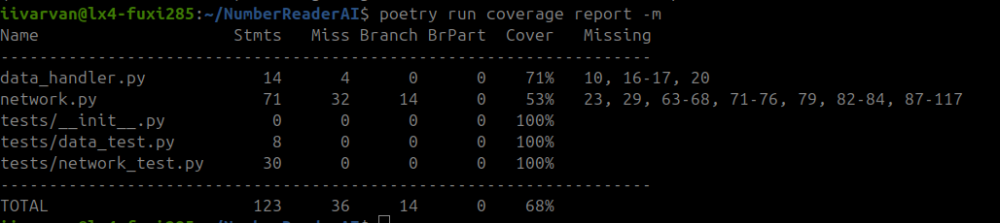

# NumberReaderAI
TKT20010 Aineopintojen harjoitustyö: Algoritmit ja tekoäly

# Interface guide
Run the interface with:
```
poetry run python3 interface.py 
```
The interface allows the user to create and pass data through networks. Currently, the network cannot yet be trained.

#### generate
This command creates a new network with the following layers: [784, 16, 16, 10].
It also gives each weight and bias a random value.
#### ff
Feed forward allows us to send data through the network. If there isin't a loaded image, the data will be random and a cost function won't be displayed. If the user has loaded an image, the image will be used instead and the cost displayed.
#### load
Load stores a random image from the test database. This image can be viewed and removed from storing. If an image is loaded, the image will be used as data in feeding forward.
#### view
Display what the image looks like and a label for what number it is supposed to be.
#### remove
Unload a loaded image. Removing when an image is not loaded does nothing.

## Testing

### Run tests
poetry run coverage run --branch -m pytest tests

### Get coverage
poetry run coverage report -m

### Run Pylint
poetry run pylint .

### Coverage
